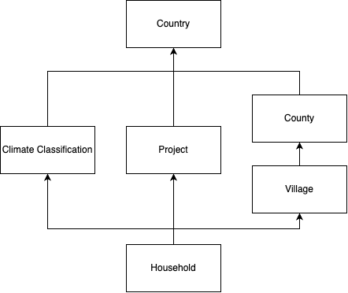

The RHoMIS dataset I am looking at has a hierarchy as follows:

```{r hierarchy_diagram, echo=FALSE, fig.align="center",out.width = '25%'}

```

Explained in words, this means: 

1. Households are nested within projects. Each "project" is nested
within a country. 
2. Households are also nested within villages, nested within counties,
nested within countries. 

Importantly, I have chosen this structure because, two projects could cover 
the same areas. To climate classifications could cover the same villages

If I were to model all levels, I use the following structure:

```{r,eval=FALSE}

model <- brm(
  formula = bf(log_tva ~ 1 +
       (1 | iso_country_code) + # Country
       (1 | iso_country_code:gdlcode) + # Country
       (1 | iso_country_code:gdlcode:village)+  # Village
       (1 | kg_class_name)+ # climate classification
       (1 | id_form)) # Project implementing survey
  ...
  
)

```

## Estimates for Group Effects (ie. sd(country), sd(iso_country_code:gdlcode) ...)


## VPCs for Group Effects


## MCMC Scatters


## Question

I believe this shows that 

### Distinguishing between projects and location:

1. How is the modelling seperating projects and location?

### 2. Prediction to new areas?

Multi-level models can predict to new areas because of 
the assumption that each of the groups 
consist of normally distributed subgroups/units.

Would this


